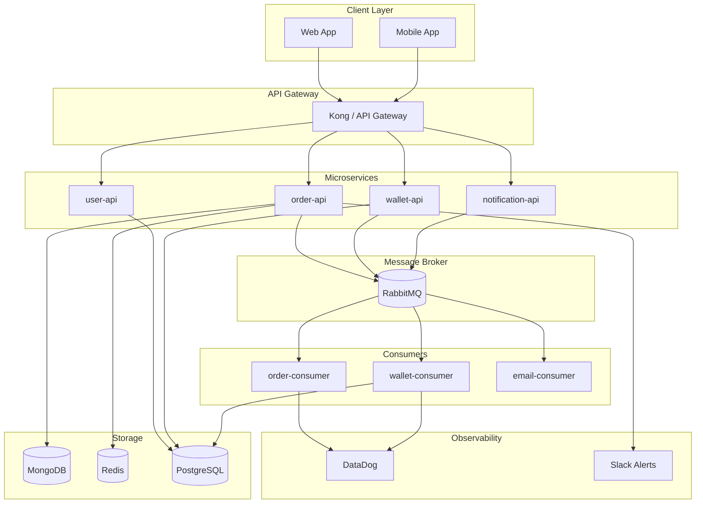

# System Architecture Overview

## High-Level Architecture

## Service Responsibilities

| Service | Language | Responsibility |
|---------|----------|----------------|
| order-api | Go | Place, cancel, and query orders |
| user-api | Go | User authentication and profile management |
| wallet-api | Go | Balance management and fund transfers |
| notification-api | Go | Push notification dispatch |
| order-consumer | Go | Process order matching from queue |
| wallet-consumer | Go | Apply wallet balance changes from queue |
| email-consumer | Go | Send transactional emails |

## Message Flow

1. Client places an order via `order-api`
2. `order-api` validates and persists to MongoDB, publishes event to RabbitMQ
3. `order-consumer` picks up the event, runs matching logic
4. On match, `order-consumer` publishes wallet debit/credit events
5. `wallet-consumer` applies balance changes to PostgreSQL
6. `notification-api` sends real-time updates back to client

## Data Store Usage

| Store | Used By | Purpose |
|-------|---------|---------|
| MongoDB | order-api, order-consumer | Order book, order history |
| Redis | order-api, order-consumer | Order book cache, TTL-based locking |
| PostgreSQL | user-api, wallet-api, wallet-consumer | User profiles, wallet balances |
